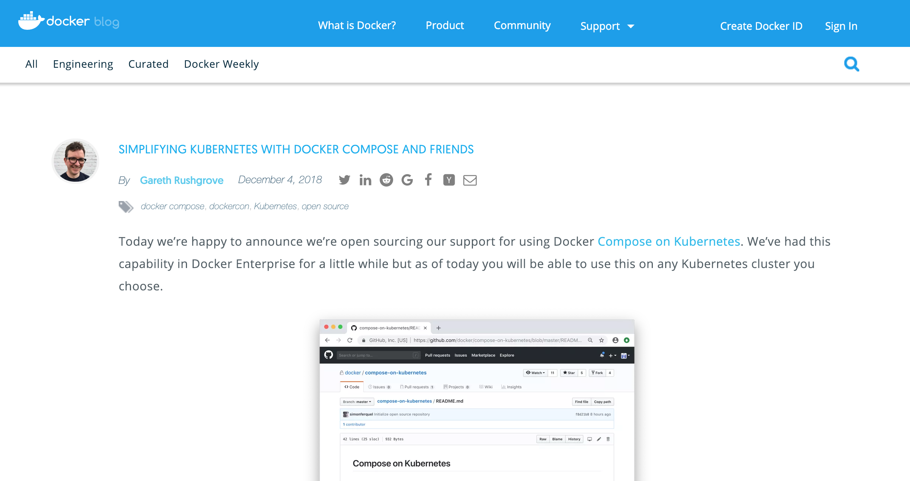
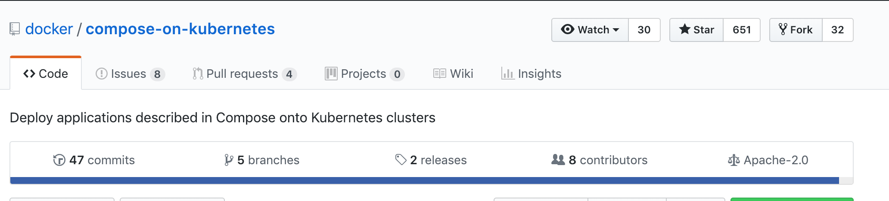
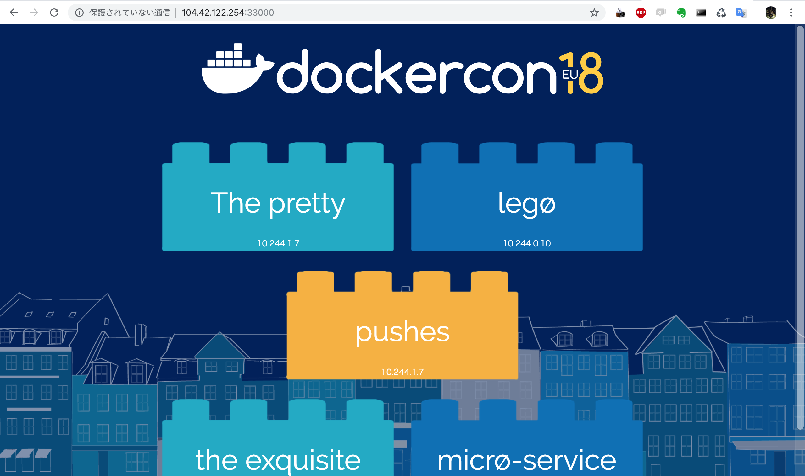
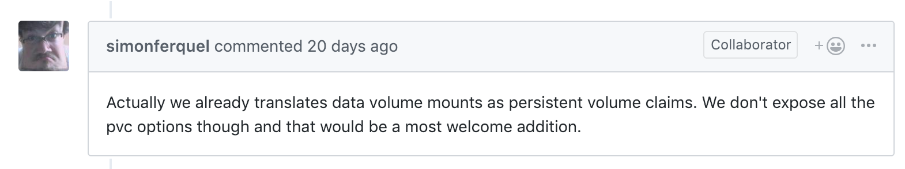

## Compose on Kubernetesについて
### Docker Kansai Meetup #2
Masaki Nakayama

---
## Compose on Kubernetesとは
---
SIMPLIFYING KUBERNETES WITH DOCKER COMPOSE AND FRIENDS
https://blog.docker.com/2018/12/simplifying-kubernetes-with-docker-compose-and-friends/

---
docker/compose-on-kubernetes
https://github.com/docker/compose-on-kubernetes

---
- docker-compose.ymlを元に、`docker stack deploy`でKubernetes環境にデプロイできる（リソースの自動作成）
- Docker Desktop と Docker Enterpriseにはインストール済
- マネージドKubernetesサービスにも当機能を手動でデプロイ可能
- 素のKubernetesを利用する場合、リソースが多くて管理が大変→開発者が簡単に扱えることを重視したcomposeを組み合わせ、Kubernetesの設定を簡素化・抽象化することを目的としている
---
## アーキテクチャ
---

https://github.com/docker/compose-on-kubernetes/blob/master/docs/architecture.md より

--
### サーバーサイド
- Compose API server
- Compose controller

### クライアントサイド
- Docker CLIによる`dockerstack deploy`
- v1beta1, v2beta2があるが、前者は廃止、後者がデフォルトになる予定
---
## Compose APIサーバー
- API Aggregationを使用してkube-apiserverと連携することでAPIを拡張することができるカスタム API Server
- stackの情報をetcdに保存する
---
## Compose コントローラー
- Compose APIサーバーからstack構造体の情報を受け取る
- それを元にKubernetes APIと通信してKubernetesリソースを作成する
---
## 経緯
---
1. 今年の初めにdockerとKubernetesの統合を進める話があり、docker-for-desktopのedge版ではkube-composeという名前でCRDとして実装されていた。
2. その後、stable版でも実装されていたが、実体はバイナリ化されていた。
3. 12月のdockercon EU 2018 でcompose on kubernetes発表。gitでも公開された。
---
## マネージドKubernetesクラスターへのデプロイ
---
- AKSにはデプロイ可能https://github.com/docker/compose-on-kubernetes/blob/master/docs/install-on-aks.md
- 同じ要領でGKEへのインストールを行ってもうまく動かない(コンポーネントのインストール自体はできるが、`docker stack deploy`時に失敗する)
https://github.com/docker/compose-on-kubernetes/issues/21

---
> dokcer-cli自体がgcp認証プロバイダをインポートしないため、cli自体がgkeに対して認証できないことが問題の原因です。cli修正のPRを作成するつもりです。

とのこと。順次、対応クラスターが増えていくと思われる。

---
## compose on KubernetesをAKSにインストール
---
前提条件
- AKSクラスター（RBAC有効）を作成済
- クライアントにhelmインストール済
- Compose on Kubernetesインストーラーをダウンロードしていること
---
作業項目
1. "compose"の名前空間を作成
2. etcdクラスターを作成
3. Compose on Kubernetesをインストーラーを使用してデプロイ 
---
### "compose"の名前空間を作成
```sh
$ kubectl create namespace compose
namespace/compose created
```
---
## etcdをデプロイ
---
- helmのサーバーサイドコンポーネントをインストール
- etcd operatorのデプロイ/etcd clusterの作成
---
tiller（helmのデプロイを担うサーバーコンポーネント）を作成
  ```sh
  $ kubectl -n kube-system create serviceaccount tiller
  serviceaccount/tiller created
  ```
---
作成したtillerサービスアカウントにcluster-admin権限をつける

```sh
$ kubectl -n kube-system create clusterrolebinding tiller --clusterrole cluster-admin --serviceaccount kube-system:tiller
clusterrolebinding.rbac.authorization.k8s.io/tiller created
```
---
helmコンポーネントの初期化

```sh
$ helm init --service-account tiller
Creating /home/planning-g/.helm
Creating /home/planning-g/.helm/repository
Creating /home/planning-g/.helm/repository/cache
Creating /home/planning-g/.helm/repository/local
Creating /home/planning-g/.helm/plugins
Creating /home/planning-g/.helm/starters
Creating /home/planning-g/.helm/cache/archive
Creating /home/planning-g/.helm/repository/repositories.yaml
Adding stable repo with URL: https://kubernetes-charts.storage.googleapis.com
Adding local repo with URL: http://127.0.0.1:8879/charts
$HELM_HOME has been configured at /home/planning-g/.helm.

Tiller (the Helm server-side component) has been installed into your Kubernetes Cluster.

Please note: by default, Tiller is deployed with an insecure 'allow unauthenticated users' policy.
To prevent this, run `helm init` with the --tiller-tls-verify flag.
For more information on securing your installation see: https://docs.helm.sh/using_helm/#securing-your-helm-installation
```
---
##  etcd operatorのデプロイ/etcd clusterの作成
---
etcd-operatorチャートをhelmでインストール

```sh
$ helm install --name etcd-operator stable/etcd-operator --namespace compose
NAME:   etcd-operator
LAST DEPLOYED: Tue Dec 25 09:31:20 2018
NAMESPACE: compose
STATUS: DEPLOYED

RESOURCES:
==> v1/Pod(related)
NAME                                                             READY  STATUS             RESTARTS  AGE
etcd-operator-etcd-operator-etcd-backup-operator-56fd448cdrwmv9  0/1    ContainerCreating  0         1s
etcd-operator-etcd-operator-etcd-operator-c5b8b8f74-chnhx        0/1    ContainerCreating  0         1s
etcd-operator-etcd-operator-etcd-restore-operator-58587cdc9k52c  0/1    ContainerCreating  0         1s

==> v1/ServiceAccount
NAME                                               SECRETS  AGE
etcd-operator-etcd-operator-etcd-backup-operator   1        2s
etcd-operator-etcd-operator-etcd-operator          1        2s
etcd-operator-etcd-operator-etcd-restore-operator  1        2s

==> v1beta1/ClusterRole
NAME                                       AGE
etcd-operator-etcd-operator-etcd-operator  2s

==> v1beta1/ClusterRoleBinding
NAME                                               AGE
etcd-operator-etcd-operator-etcd-backup-operator   2s
etcd-operator-etcd-operator-etcd-operator          2s
etcd-operator-etcd-operator-etcd-restore-operator  2s

==> v1/Service
NAME                   TYPE       CLUSTER-IP   EXTERNAL-IP  PORT(S)    AGE
etcd-restore-operator  ClusterIP  10.0.132.45  <none>       19999/TCP  1s

==> v1beta2/Deployment
NAME                                               DESIRED  CURRENT  UP-TO-DATE  AVAILABLE  AGE
etcd-operator-etcd-operator-etcd-backup-operator   1        1        1           0          1s
etcd-operator-etcd-operator-etcd-operator          1        1        1           0          1s
etcd-operator-etcd-operator-etcd-restore-operator  1        1        1           0          1s


NOTES:
1. etcd-operator deployed.
  If you would like to deploy an etcd-cluster set cluster.enabled to true in values.yaml
  Check the etcd-operator logs
    export POD=$(kubectl get pods -l app=etcd-operator-etcd-operator-etcd-operator --namespace compose --output name)
    kubectl logs $POD --namespace=compose
```
---
etcd clusterの作成

```yaml
apiVersion: "etcd.database.coreos.com/v1beta2"
kind: "EtcdCluster"
metadata:
  name: "compose-etcd"
  namespace: "compose"
spec:
  size: 3
  version: "3.2.13"
```

```sh
$ kubectl apply -f compose-etcd.yaml
etcdcluster.etcd.database.coreos.com/compose-etcd created
```
---
名前空間「compose」にetcdクラスターのリソースができている
```sh
$ kubectl get all -n compose
NAME                                                                  READY     STATUS    RESTARTS   AGE
pod/compose-etcd-dkk6hzqm4b                                           1/1       Running   0          1m
pod/compose-etcd-nmpd895rjl                                           1/1       Running   0          2m
pod/compose-etcd-xqfql85tg5                                           1/1       Running   0          1m
pod/etcd-operator-etcd-operator-etcd-backup-operator-56fd448cdrwmv9   1/1       Running   0          4m
pod/etcd-operator-etcd-operator-etcd-operator-c5b8b8f74-chnhx         1/1       Running   0          4m
pod/etcd-operator-etcd-operator-etcd-restore-operator-58587cdc9k52c   1/1       Running   0          4m

NAME                            TYPE        CLUSTER-IP    EXTERNAL-IP   PORT(S)             AGE
service/compose-etcd            ClusterIP   None          <none>        2379/TCP,2380/TCP   2m
service/compose-etcd-client     ClusterIP   10.0.197.57   <none>        2379/TCP            2m
service/etcd-restore-operator   ClusterIP   10.0.132.45   <none>        19999/TCP           4m

NAME                                                                DESIRED   CURRENT   UP-TO-DATE   AVAILABLE   AGE
deployment.apps/etcd-operator-etcd-operator-etcd-backup-operator    1         1         1            1           4m
deployment.apps/etcd-operator-etcd-operator-etcd-operator           1         1         1            1           4m
deployment.apps/etcd-operator-etcd-operator-etcd-restore-operator   1         1         1            1           4m

NAME                                                                           DESIRED   CURRENT   READY     AGE
replicaset.apps/etcd-operator-etcd-operator-etcd-backup-operator-56fd448cd6    1         1         1         4m
replicaset.apps/etcd-operator-etcd-operator-etcd-operator-c5b8b8f74            1         1         1         4m
replicaset.apps/etcd-operator-etcd-operator-etcd-restore-operator-58587cdccf   1         1         1         4m
```

---

compose-on-kubernetesをインストール（※Cloud Shellでバイナリ認識できなかったのでmacからaksクラスター指定してインストールさせてます）
```sh
$ ./installer-darwin -namespace=compose -etcd-servers=http://compose-etcd-client:2379 -tag=v0.4.16 -skip-liveness-probes=true --kubeconfig=/Users/nakayama/.kube/aksconfig
INFO[0000] Checking installation state
INFO[0001] Install image with tag "v0.4.16" in namespace "compose"
INFO[0003] Api server: image: "docker/kube-compose-api-server:v0.4.16", pullPolicy: "Always"
INFO[0003] Controller: image: "docker/kube-compose-controller:v0.4.16", pullPolicy: "Always"
```

---
インストールを確認
```sh
$ kubectl api-versions | grep compose
compose.docker.com/v1beta1
compose.docker.com/v1beta2
```
---
```sh
$ kubectl get all -n compose
NAME                                                                  READY     STATUS    RESTARTS   AGE
pod/compose-5c84c46dd5-4ldpn                                          1/1       Running   0          4m
pod/compose-api-8694d77dd-5drfk                                       1/1       Running   0          4m
pod/compose-etcd-dkk6hzqm4b                                           1/1       Running   0          40m
pod/compose-etcd-nmpd895rjl                                           1/1       Running   0          40m
pod/compose-etcd-xqfql85tg5                                           1/1       Running   0          40m
pod/etcd-operator-etcd-operator-etcd-backup-operator-56fd448cdrwmv9   1/1       Running   0          43m
pod/etcd-operator-etcd-operator-etcd-operator-c5b8b8f74-chnhx         1/1       Running   0          43m
pod/etcd-operator-etcd-operator-etcd-restore-operator-58587cdc9k52c   1/1       Running   0          43m

NAME                            TYPE        CLUSTER-IP    EXTERNAL-IP   PORT(S)             AGE
service/compose-api             ClusterIP   10.0.90.8     <none>        443/TCP             4m
service/compose-etcd            ClusterIP   None          <none>        2379/TCP,2380/TCP   40m
service/compose-etcd-client     ClusterIP   10.0.197.57   <none>        2379/TCP            40m
service/etcd-restore-operator   ClusterIP   10.0.132.45   <none>        19999/TCP           43m

NAME                                                                DESIRED   CURRENT   UP-TO-DATE   AVAILABLE   AGE
deployment.apps/compose                                             1         1         1            1           4m
deployment.apps/compose-api                                         1         1         1            1           4m
deployment.apps/etcd-operator-etcd-operator-etcd-backup-operator    1         1         1            1           43m
deployment.apps/etcd-operator-etcd-operator-etcd-operator           1         1         1            1           43m
deployment.apps/etcd-operator-etcd-operator-etcd-restore-operator   1         1         1            1           43m

NAME                                                                           DESIRED   CURRENT   READY     AGE
replicaset.apps/compose-5c84c46dd5                                             1         1         1         4m
replicaset.apps/compose-api-8694d77dd                                          1         1         1         4m
replicaset.apps/etcd-operator-etcd-operator-etcd-backup-operator-56fd448cd6    1         1         1         43m
replicaset.apps/etcd-operator-etcd-operator-etcd-operator-c5b8b8f74            1         1         1         43m
replicaset.apps/etcd-operator-etcd-operator-etcd-restore-operator-58587cdccf   1         1         1         43m

```
---
APIServiceができている
```sh
$ kubectl get apiservice
NAME                                    CREATED AT
v1beta1.compose.docker.com              2018-12-25T10:10:25Z
v1beta2.compose.docker.com              2018-12-25T10:10:25Z
```
---
## docker stack deployしてみる
---
下記のdocker-compose.ymlを使用（dockerconのサンプル画面が映るだけのデモアプリ）

```yaml
version: '3.3'

services:

  db:
    build: db
    image: dockersamples/k8s-wordsmith-db

  words:
    build: words
    image: dockersamples/k8s-wordsmith-api
    deploy:
      replicas: 5

  web:
    build: web
    image: dockersamples/k8s-wordsmith-web
    ports:
     - "33000:80"
```
---

デプロイする
```sh
$ docker stack deploy --orchestrator=kubernetes -c docker-compose.yml hellokube
Ignoring unsupported options: build

service "web": build is ignored
service "db": build is ignored
service "words": build is ignored
Waiting for the stack to be stable and running...
words: Ready            [pod status: 1/5 ready, 4/5 pending, 0/5 failed]
db: Ready               [pod status: 1/1 ready, 0/1 pending, 0/1 failed]
web: Ready              [pod status: 1/1 ready, 0/1 pending, 0/1 failed]

Stack hellokube is stable and running
```
---
stackができている
```sh
$ kubectl get stack
NAME         SERVICES   PORTS              STATUS                            CREATED AT
hellokube    3          web: 33000         Available (Stack is started)      2018-12-25T10:19:00Z
```
---
各種Kubernetesリソースが作成されている

```sh
$ kubectl get all
NAME                             READY     STATUS                       RESTARTS   AGE
pod/db-6d9f665b97-jr6ql          1/1       Running                      0          23h
pod/web-786c88c676-c68ff         1/1       Running                      0          23h
pod/words-7d88595b-btmzj         1/1       Running                      0          23h
pod/words-7d88595b-c7gf9         1/1       Running                      0          23h
pod/words-7d88595b-gdxj4         1/1       Running                      0          23h
pod/words-7d88595b-wjvf5         1/1       Running                      0          23h
pod/words-7d88595b-x4n49         1/1       Running                      0          23h

NAME                           TYPE           CLUSTER-IP    EXTERNAL-IP      PORT(S)           AGE
service/db                     ClusterIP      None          <none>           55555/TCP         23h
service/kubernetes             ClusterIP      10.0.0.1      <none>           443/TCP           1d
service/web                    ClusterIP      None          <none>           55555/TCP         23h
service/web-published          LoadBalancer   10.0.69.114   104.42.122.254   33000:32613/TCP   23h
service/words                  ClusterIP      None          <none>           55555/TCP         23h

NAME                         DESIRED   CURRENT   UP-TO-DATE   AVAILABLE   AGE
deployment.apps/db           1         1         1            1           23h
deployment.apps/web          1         1         1            1           23h
deployment.apps/words        5         5         5            5           23h

NAME                                    DESIRED   CURRENT   READY     AGE
replicaset.apps/db-6d9f665b97           1         1         1         23h
replicaset.apps/web-786c88c676          1         1         1         23h
replicaset.apps/words-7d88595b          5         5         5         23h
```

---
EXTERNAL-IP を確認
```sh
$ kubectl get svc
NAME            TYPE           CLUSTER-IP    EXTERNAL-IP      PORT(S)           AGE
db              ClusterIP      None          <none>           55555/TCP         4h
kubernetes      ClusterIP      10.0.0.1      <none>           443/TCP           10h
web             ClusterIP      None          <none>           55555/TCP         4h
web-published   LoadBalancer   10.0.69.114   104.42.122.254   33000:32613/TCP   4h
words           ClusterIP      None          <none>           55555/TCP         4h
```
@[6]

---
アプリが立ち上がっている!

---
`docker stack deploy`によって
- deployment
- replicaset
- service
- pod

は作成してくれている
---
*** あれ、volumeは・・・？ ***
---
https://github.com/docker/compose-on-kubernetes/issues/10

今後のPRで追加していくつもり！
